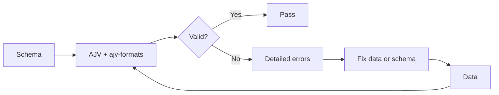

# Patterns

## Reusable Patterns from MJU-DRP

### 1. Schema Validation Pattern

For any registry/data project that needs JSON Schema validation:



**Applicable to:** Any project using JSON Schema for data validation.

**Prerequisites:** `npm install ajv ajv-formats`

### 2. Multi-Format Search Pattern

Support multiple search levels without overcomplicating the architecture:

| Level | Tool | When to Use |
|-------|------|-------------|
| Quick filter | `Array.filter()` in JSON | <50 documents, no search bar needed |
| Client search | MiniSearch | 50-5000 documents, needs search bar |
| Production search | Pagefind | Static site with HTML pages, needs search |

**Principle:** Start simple (filter), upgrade to MiniSearch, add Pagefind when ready. No need to choose one forever.

### 3. Metadata Registry Pattern

A metadata registry for documents stored in another system:

```
Storage layer (SharePoint/OneDrive) ←─── Binary files
    │                                      ↑
    └─── share_url ────────────────────────┘
Registry (git JSON) ←─── metadata + URLs
    │
    ↓
Output (dist JSON) → Consumer projects
```

**Key rules:**
- Registry stores metadata only, not files
- Share URL is the connection to the binary
- Consumer projects read outputs, not directly from storage
- Validation ensures metadata integrity

### 4. Certification Sprint Pattern

Before integrating any new technology, run a certification sprint:

```
Week 1: Research & select candidates
Week 2: Practical verification (install, test, measure)
Week 3: Document findings + make decision
Week 4: Next sprint — integrate certified tools
```

**Outputs:**
- Per-tool certification report (why, how, results, limitations, decision)
- Updated capability matrix
- Updated build-vs-buy decisions
- Knowledge base entries

### 5. Memory System Pattern

For AI-assisted development, maintain a lightweight memory system:

| File | Purpose | Frequency |
|------|---------|-----------|
| CURRENT_STATE.md | Current phase, branch, status | Every sprint |
| NEXT_TASK.md | Upcoming objectives | Every sprint |
| LAST_HANDOFF.md | Compact handoff summary | Every session |
| SESSION_LOG.md | Append-only activity log | Every session |
| DECISIONS.md | Architecture Decision Records | When decisions are made |

**Principle:** Keep files small enough for an AI agent to read in a single context window.

### 6. Token-Savior Pattern

For efficient AI agent operation:

1. **Compact handoffs** — LAST_HANDOFF.md fits in one screen
2. **Append-only logs** — SESSION_LOG.md grows; agents read only the last entry
3. **Reference docs** — Detailed docs (certification reports) are referenced, not embedded
4. **Status fields** — CURRENT_STATE.md uses tables for quick scanning
5. **ADRs** — Decisions are captured once and cross-referenced

### 7. Static-First JSON Output Pattern

For serving data to consumer projects without a database:

```
Registry data (JSON) → Validation (AJV) → Generation (script) → dist/*.json → git commit → CI → Consumer fetch
```

**Benefits:**
- No database provisioning
- No API development
- No connection management
- No scaling concerns
- Versioned with git
- Zero runtime cost

**When to add a database:** When the registry exceeds 50,000 documents OR when real-time writes are needed.

### 8. Dependency Verification Pattern

Before committing to a dependency:

1. Install it in a test environment
2. Test with real project data
3. Test at multiple scales (1x, 10x, 100x)
4. Test edge cases (empty, missing, invalid data)
5. Test CI compatibility (npm ci, no network)
6. Document results in a certification report

### 9. MCP Integration Pattern

For AI tool access in Cursor:

```
Cursor IDE ←─── MCP Protocol
    │
    ├── Filesystem MCP → Local file operations
    ├── GitHub MCP → Repository operations
    └── Other MCPs → As needed
```

**Configuration location:** `~/.cursor/mcp.json` (user-level) or `.cursor/mcp.json` (project-level)

**Security:** Tokens in environment variables, server sandboxed to project directory.

### 10. SharePoint-MJU-DRP Alignment Pattern

For aligning SharePoint folder structure with registry taxonomy:

```
SharePoint folder: /sites/GreenOffice/Shared Documents/01-Plans/
Registry entry:    { "category": "plan", "storage_path": "/sites/GreenOffice/Shared Documents/01-Plans/GO2026-Plan.pdf" }
```

**Rule:** Numbered prefixes in SharePoint folder names (01-Plans, 02-Guidelines) should match registry category priority. This keeps both systems in sync visually.
